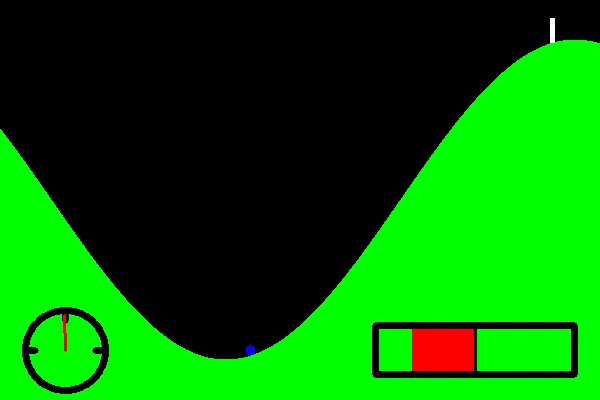

# Caffe_DDPG: A Caffe/C++ implementation of [Deep Deterministic Policy Gradient](https://arxiv.org/pdf/1509.02971.pdf) algorithm

There are a lot of implementation of DDPG with Tensorflow and Python, but I couldn't find any with Caffe. So here a DDPG on the continuous mountain car example using Caffe.

## Dependencies

This code relies on [Caffe main branch](https://github.com/BVLC/caffe) with only two slight modifications in `solver.hpp`: 

- ApplyUpdate function must be moved from protected to public in Solver class definition
- iter_ must be moved from protected to public in Solver class definition

OpenCV is also used, but you should already have it installed if you have Caffe.

I have only tested this code on Windows with Visual Studio 2015, but it should also be able to run on Linux and OS X provided that Caffe is correctly installed with the above modification.

## Building

The project uses CMake as a building tool.
Once you have correctly built and compiled the code, you should be abble to launch the program for both training and testing.

## Training

To train a new agent, set the training parameters as you want and then launch `launch_files/train.bat` (or the equivalent command line if you are not on Windows). After **num_episodes** of training, the model is automatically tested and saved.

## Testing

To test the performance of an agent, set the testing parameters and then launch `launch_files/test.bat`.
Files with the weights of a trained agent is provided if you just want to see it in action: `launch_files/Trained_Actor|Critic.caffemodel`.

If you have set display parameter on, you should see something like this: 

## License

MIT